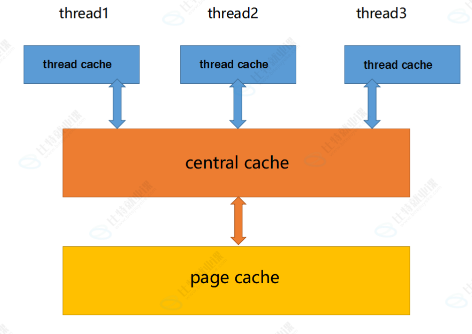

# 高并发内存池

## 项目介绍

本项目参考 Google 开源项目 TCMalloc（Thread-Caching Malloc）实现了一套高并发内存池。

TCMalloc 全称为 **Thread-Caching Malloc**，是一种高性能、多线程内存管理方案，用于替代系统默认的内存分配接口（malloc/free），通过线程缓存机制降低锁竞争，提高内存分配效率

本项目实现了 TCMalloc 的核心三级缓存架构，包括：

* ThreadCache（线程缓存）
* CentralCache（中心缓存）
* PageCache（页缓存）

实现了高并发场景下的小对象快速分配与释放。

---

## 技术栈

* C++
* STL
* 数据结构（自由链表、哈希桶）
* 操作系统内存管理
* 单例模式
* 多线程编程
* 互斥锁与线程同步
* 内存池设计

---

## 核心架构

TCMalloc 采用三级缓存架构，从线程私有缓存到全局共享缓存逐层管理内存，最大程度减少线程间锁竞争。



```text
用户层
│
├── ConcurrentAlloc / ConcurrentFree
│
├── ThreadCache（线程私有缓存）
│   ├── 无锁自由链表
│   ├── 慢启动批量申请策略
│   └── 超阈值自动回收
│
├── CentralCache（中心缓存）
│   ├── 分桶细粒度锁
│   ├── Span 管理
│   ├── 内存块归还
│   └── Span 空闲检测
│
└── PageCache（页缓存）
    ├── 全局页锁
    ├── 向系统申请内存
    ├── Span 拆分与合并
    └── PageID ↔ Span 映射
```

---

## 模块设计

### ThreadCache

线程私有缓存。

特点：

* 每个线程独立维护
* 无锁访问
* 小对象快速分配
* 减少全局锁竞争

---

### CentralCache

中心缓存。

特点：

* 多线程共享
* 分桶管理 Span
* 使用桶锁降低竞争
* 为 ThreadCache 提供内存块

---

### PageCache

页缓存。

特点：

* 管理大块内存
* 向操作系统申请页空间
* Span 的拆分与合并
* 建立页号与 Span 的映射关系

---

## 项目结构

```text
ConcurrentMemoryPool/
├── Common.h
├── Fixed-size_memory_pool.h
├── ThreadCache.h
├── ThreadCache.cpp
├── CentralCache.h
├── CentralCache.cpp
├── PageCache.h
├── PageCache.cpp
├── ConcurrentAlloc.h
├── Benchmark.cpp
├── UnitTest.cpp
└── README.md
```

文件说明：

| 文件                       | 功能             |
| ------------------------ | -------------- |
| Common.h                 | 公共定义、工具函数、内存对齐 |
| Fixed-size_memory_pool.h | 定长对象池          |
| ThreadCache              | 线程缓存实现         |
| CentralCache             | 中心缓存实现         |
| PageCache                | 页缓存实现          |
| ConcurrentAlloc          | 用户接口           |
| Benchmark                | 性能测试           |
| UnitTest                 | 单元测试           |

---

## 核心优化

### 1. ThreadCache 无锁分配

线程独享自由链表。

避免频繁加锁，提高分配效率。

### 2. 慢启动机制

初始申请少量对象。

随着需求增长逐步扩大批量申请数量。

减少内存浪费。

### 3. CentralCache 分桶锁

不同大小对象对应不同桶。

仅锁定当前桶。

降低锁竞争。

### 4. Span 自动合并

当 Span 完全空闲时：

* 回收至 PageCache
* 与前后空闲 Span 自动合并

降低内存碎片率。

---

## 性能测试

测试环境：

* 多线程并发申请与释放内存
* 与系统 malloc/free 进行对比

测试指标：

* 吞吐量（QPS）
* 总耗时
* 锁竞争情况

运行：

```bash
Benchmark.cpp
```

可观察多线程场景下内存池相比系统 malloc/free 的性能提升。

---

## 编译运行

### Windows

使用 Visual Studio：

1. 新建空项目
2. 添加全部源文件
3. 编译运行

性能测试：

```text
运行 Benchmark.cpp
```

---

### Linux

项目已预留：

* mmap
* brk

等系统接口扩展位置。

补充对应实现后即可跨平台编译运行。

---
